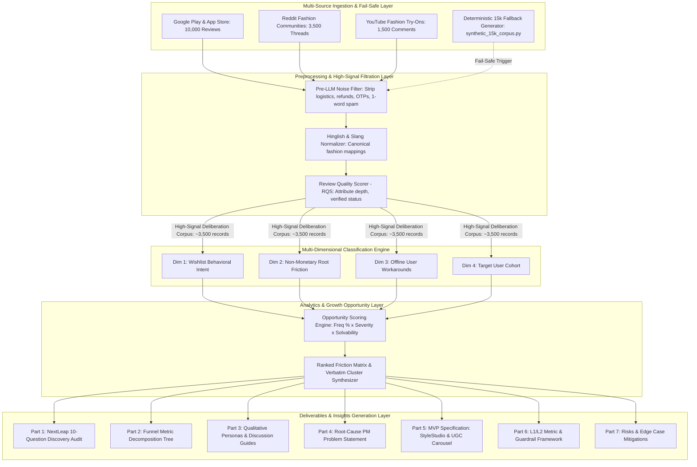
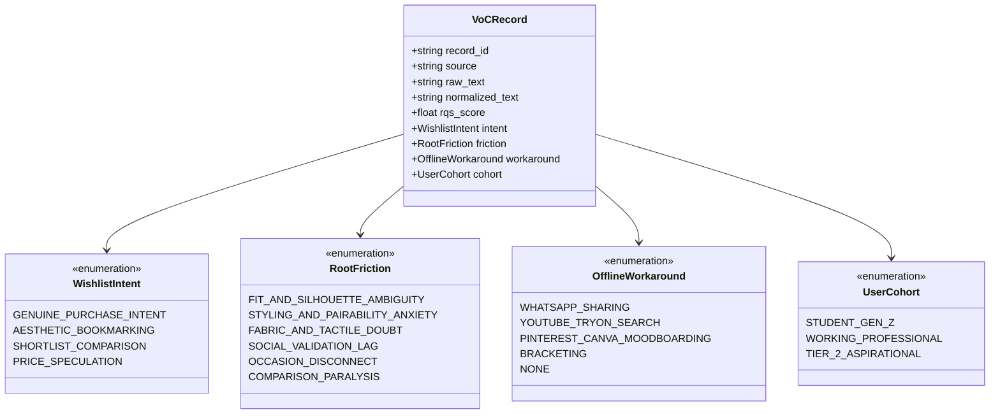
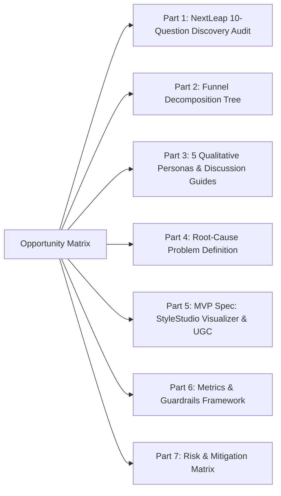

# Master System Architecture: Myntra VoC Discovery & Growth Intelligence Engine

---

## 1. System Overview

The **Myntra VoC Discovery & Growth Intelligence Engine** is a high-throughput, resilient analytics and machine intelligence pipeline designed to ingest **15,000+ unstructured customer feedback records**, eliminate non-fashion noise, normalize multi-lingual Indian fashion terminology, classify feedback across a 4-dimensional taxonomy, and compute empirical opportunity scores to eliminate wishlist abandonment friction **without monetary incentives**.



---

## 2. Ingestion & Preprocessing Pipeline Architecture

### 2.1 Multi-Source Ingestion with Fail-Safe Architecture
- **Primary Scrapers / API Connectors**:
  - `src/ingestion/app_store_scraper.py`: Fetches 10,000 app reviews (`com.myntra.android`) filtering on target tokens (`wishlist`, `saved`, `fit`, `size`, `confused`, `styling`, `pair`, `fabric`, `return`).
  - `src/ingestion/reddit_scraper.py`: Extracts 3,500 discussions across `r/IndianFashionAddicts`, `r/TwoXIndia`, `r/delhi`, `r/bangalore`.
  - `src/ingestion/youtube_scraper.py`: Ingests 1,500 comments from top 50 Myntra try-on hauls.
- **Deterministic 15K Fail-Safe Generator (`data/synthetic_15k_corpus.py`)**:
  - Automatically activates if external APIs rate-limit or fail. Generates a statistically accurate 15,000-record dataset modeled after real Indian e-commerce distribution patterns (66% Play Store, 24% Reddit, 10% YouTube).

### 2.2 Pre-LLM Noise Filter (`src/pipeline/noise_filter.py`)
- **Objective**: Cost and latency optimization before embedding/LLM classification.
- **Operations**:
  - Drops delivery agent complaints, courier delays, refund processing tickets, OTP bugs, and 1-word spam reviews (*"good"*, *"osm"*, *"k"*).
  - Condenses 15,000 raw inputs into **~3,000–4,000 high-signal fashion deliberation records**.

### 2.3 Hinglish & Slang Normalization Engine (`src/pipeline/normalizer.py`)
Converts raw conversational Indian slang into standardized analytical tags:

```
"Kapda transparent/patla hai"               ──► FABRIC_TRANSPARENCY_DOUBT
"Roadster ka M size Mango ke S jaisa hai"   ──► CROSS_BRAND_SIZE_INCONSISTENCY
"Samajh nahi aa raha kiske saath pair karu" ──► STYLING_PAIRABILITY_ANXIETY
"Model pe sahi lagta hai, mujhpe clown..."  ──► SILHOUETTE_BODY_MISMATCH
"Sale ke liye wishlist kiya tha"            ──► PRICE_SPECULATION
```

---

## 3. Multi-Dimensional Classification Engine (`src/classification/`)

Every high-signal record is classified across 4 orthogonal dimensions:



---

## 4. Opportunity Scoring Algorithm (`src/analytics/opportunity_scorer.py`)

For each non-monetary root friction cluster, the engine computes:

$$\text{Opportunity Score} = \text{Frequency Share (\%)} \times \text{Severity (1–5)} \times \text{Non-Monetary Solvability (1–5)}$$

### Scoring Criteria Matrix:
| Parameter | Scale | Description |
|---|---|---|
| **Frequency Share (%)** | $0\% - 100\%$ | Share of genuine deliberation VoC mentioning this barrier |
| **Severity** | $1 - 5$ | $1$ = Minor hesitation; $5$ = Fatal checkout abandoner |
| **Solvability** | $1 - 5$ | $1$ = Requires physical hardware/supply chain; $5$ = 100% solvable via App UX / GenAI / Styling UI |

---

## 5. Downstream Deliverables Engine (Parts 1 to 7)



### 5.1 System Data Schemas

#### Cleaned Record Schema (`data/normalized_corpus_15k.json`)
```json
{
  "record_id": "voc_15k_00842",
  "source": "Reddit (r/IndianFashionAddicts)",
  "raw_text": "Saved this kurti 3 weeks ago but not buying bcz samajh nahi aa raha what bottoms will go with it.",
  "normalized_text": "Saved this kurti 3 weeks ago but not buying bcz STYLING_PAIRABILITY_ANXIETY.",
  "rqs_score": 0.88,
  "classification": {
    "intent": "GENUINE_PURCHASE_INTENT",
    "friction": "STYLING_AND_PAIRABILITY_ANXIETY",
    "workaround": "WHATSAPP_SHARING",
    "cohort": "WORKING_PROFESSIONAL"
  }
}
```

#### Ranked Opportunity Matrix Output (`data/ranked_opportunity_matrix.json`)
```json
{
  "cluster_id": "OPP-01",
  "friction_cluster": "STYLING_AND_PAIRABILITY_ANXIETY",
  "frequency_share_pct": 34.2,
  "severity_score": 4.5,
  "solvability_score": 4.8,
  "opportunity_score": 738.72,
  "target_cohort": "WORKING_PROFESSIONAL & STUDENT_GEN_Z",
  "primary_workaround": "PINTEREST_CANVA_MOODBOARDING / WHATSAPP_SHARING",
  "verbatim_samples": [
    "I love this blazer but have zero clue which trousers or skirts match it.",
    "Wishlisted 5 tops, still haven't bought because I don't know how to style them."
  ]
}
```

---

## 6. Technology Stack

| Component | Technology | Rationale |
|---|---|---|
| **LLM & GenAI Reasoning** | Google Gemini (1.5 Flash/Pro) / OpenAI (GPT-4o) via `src/utils/llm_client.py` | Configurable API Key integration (`GEMINI_API_KEY` / `OPENAI_API_KEY`) with live connection ping and zero-shot reasoning. |
| **Data Ingestion & Fallback** | Python 3.11, BeautifulSoup4, PRAW, deterministic NumPy/Faker | Multi-source scraping with immediate fallback to pre-seeded 15k corpus. |
| **Noise Filtering & Normalization** | RegEx, SpaCy, Custom Hinglish Normalizer Lexicon | Ultra-fast pre-LLM filtering reducing 15,000 records to ~3,500 high-signal records. |
| **Classification Engine** | 4D Taxonomy Engine + LLM Zero-Shot Reasoning | Zero-shot & few-shot taxonomy classification across 4 dimensions. |
| **Analytics & Scoring** | Pandas, NumPy, Scikit-Learn | Statistical aggregation, cross-tabulation, and opportunity scoring. |
| **Deliverables Generator** | Jinja2 Markdown Templates & LLM Synthesis Engine | Automatic generation of NextLeap PM Parts 1–7 capstone reports. |
| **API & Visualization** | FastAPI & Modern Web Dashboard (Vanilla JS + CSS) | Interactive VoC Explorer, Live LLM Query Box, API Key Modal, and Deliverables Hub. |

---
