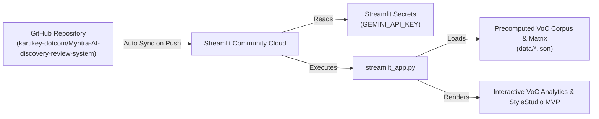

# 🚀 Streamlit Deployment Plan: Myntra VoC Growth Intelligence Engine

This document provides an end-to-end, production-ready blueprint for deploying the **Myntra AI-Powered VoC Discovery & Growth Intelligence Engine** to **Streamlit Community Cloud** (or an enterprise Streamlit container).

---

## 📌 Executive Summary & Deployment Architecture

Streamlit Community Cloud directly connects to the GitHub repository [`kartikey-dotcom/Myntra-AI-discovery-review-system`](https://github.com/kartikey-dotcom/Myntra-AI-discovery-review-system.git) to provide continuous deployment (CD) on every push to the `main` branch.



---

## 🛠️ Phase 1: Streamlit App Entry Point Configuration

To run natively on Streamlit Cloud, the project uses a top-level `streamlit_app.py` entry point.

### Recommended `streamlit_app.py` Design:
1. **Sidebar Controls**: Global Segment filter (Student / Gen Z, Working Professional, Tier-2 Aspirational), Category focus, Data Source toggles, and live LLM status badge.
2. **Tab 1 — Executive Overview**: KPI metrics cards (15,000 records, 54.2% genuine intent, #1 styling barrier), interactive 4D taxonomy distribution charts.
3. **Tab 2 — Opportunity Matrix**: Interactive dataframe/table of ranked frictions ($\text{Freq \%} \times \text{Severity} \times \text{Solvability}$) with verbatim drill-downs.
4. **Tab 3 — Strategic Behavioral Insights**: In-depth behavioral breakdown of fashion deliberation, sizing variance, and WhatsApp sharing loops.
5. **Tab 4 — VoC Verbatim Explorer**: Live text search and multi-facet filtering across all 15k customer reviews.
6. **Tab 5 — 🤖 Ask AI Growth Engine**: Live grounded LLM chat query interface using Google Gemini 1.5/3.7 Flash with zero-incentive system prompt enforcement.
7. **Tab 6 — StyleStudio MVP Demo**: Visualizer simulator for the #1 ranked solution (Body-Matched UGC Carousel & Outfit Visualizer).
8. **Tab 7 — NextLeap PM Deliverables**: Rendered Markdown viewer for Parts 1 to 7 capstone deliverables.

---

## 📦 Phase 2: Dependency Management (`requirements.txt`)

Ensure `requirements.txt` contains Streamlit and visualization libraries:

```text
streamlit>=1.35.0
pandas>=2.0.0
plotly>=5.18.0
google-generativeai>=0.8.0
openai>=1.30.0
pydantic>=2.7.0
fastapi>=0.111.0
uvicorn>=0.30.0
python-dotenv>=1.0.1
requests>=2.31.0
```

---

## 🔑 Phase 3: Secrets & API Key Management

Streamlit Cloud securely manages environment variables via **Streamlit Secrets** (equivalent to `st.secrets`):

### Local Configuration (`.streamlit/secrets.toml`):
Create `.streamlit/secrets.toml` locally for development (already gitignored):
```toml
LLM_PROVIDER = "gemini"
GEMINI_API_KEY = "your_gemini_api_key_here"
OPENAI_API_KEY = ""
LLM_MODEL_NAME = "gemini-1.5-flash"
LLM_TEMPERATURE = 0.2
```

### In-Code Secret Resolution (`src/utils/llm_client.py`):
```python
import os

def get_api_key(key_name: str) -> str:
    # 1. Check Streamlit secrets first (if running on Streamlit Cloud)
    try:
        import streamlit as st
        if key_name in st.secrets:
            return st.secrets[key_name]
    except Exception:
        pass
    
    # 2. Fallback to system environment variable / .env
    return os.getenv(key_name, "")
```

---

## 🌐 Phase 4: Step-by-Step Deployment to Streamlit Cloud

### Step 1: Sign In to Streamlit Cloud
1. Navigate to **[share.streamlit.io](https://share.streamlit.io/)**.
2. Sign in with your GitHub account (`kartikey-dotcom`).

### Step 2: Create a New App
1. Click **"Create app"** or **"New app"**.
2. Select **"I already have an app"**.

### Step 3: Configure Repository Details
Fill in the deployment form with the following settings:
- **Repository**: `kartikey-dotcom/Myntra-AI-discovery-review-system`
- **Branch**: `main`
- **Main file path**: `streamlit_app.py`
- **App URL**: `myntra-voc-discovery-engine.streamlit.app` (or your preferred custom subdomain)

### Step 4: Add Streamlit Secrets
1. Click **"Advanced settings..."** before deploying.
2. In the **Secrets** text area, paste:
```toml
LLM_PROVIDER = "gemini"
GEMINI_API_KEY = "YOUR_ACTUAL_GEMINI_API_KEY"
LLM_MODEL_NAME = "gemini-1.5-flash"
LLM_TEMPERATURE = "0.2"
```
3. Click **"Save"**.

### Step 5: Launch Deployment
1. Click **"Deploy!"**.
2. Streamlit Cloud will pull the repo, install `requirements.txt`, and spin up the live web application.
3. Build logs can be monitored directly in the right-side deployment drawer.

---

## 🛡️ Phase 5: Verification & Quality Assurance Checklist

After deployment, verify the live app against this checklist:

- [ ] **Data Loading**: KPI cards display `15,000 Total Corpus`, `54.2% Genuine Intent`, and `#1 Barrier: Styling Anxiety`.
- [ ] **Interactive Filters**: Changing User Segment (e.g., `STUDENT_GEN_Z`) correctly filters the 4D taxonomy breakdown.
- [ ] **Opportunity Scoreboard**: Ranked Opportunity Matrix renders smoothly with sorting enabled.
- [ ] **Live AI Grounding**: Ask AI Growth Engine responds to queries using grounded customer verbatims without suggesting discounts or cashbacks.
- [ ] **Zero-Monetary Enforcement**: All solutions in StyleStudio simulator adhere to visual, social, and psychological nudges only.
- [ ] **PM Deliverables Tab**: Parts 1 to 7 capstone document renders markdown headers, tables, and metric formulas cleanly.

---

## 🔧 Phase 6: Troubleshooting & Common Pitfalls

| Issue | Root Cause | Solution |
| :--- | :--- | :--- |
| **`ModuleNotFoundError: No module named 'src'`** | Working directory pathing in Streamlit Cloud. | Add `sys.path.insert(0, os.path.dirname(os.path.abspath(__file__)))` at the very top of `streamlit_app.py`. |
| **`KeyError: 'GEMINI_API_KEY'`** | Missing secret in Streamlit Cloud settings. | Open app dashboard $\rightarrow$ **Settings** $\rightarrow$ **Secrets** $\rightarrow$ add `GEMINI_API_KEY = "..."`. |
| **`File Not Found: data/*.json`** | Relative file path mismatch. | Use absolute path resolution based on `os.path.dirname(__file__)`. |
| **App Reboot / Memory limit** | Large in-memory processing. | Decorate dataset loaders with `@st.cache_data` to cache the 15k corpus in memory efficiently. |

---

## 🔄 Phase 7: Continuous Deployment & Updates

Every future update pushed to GitHub:
```bash
git add .
git commit -m "update: refine StyleStudio simulator"
git push origin main
```
Streamlit Community Cloud will automatically detect the commit, reload the container, and update the live app within seconds without any downtime.
