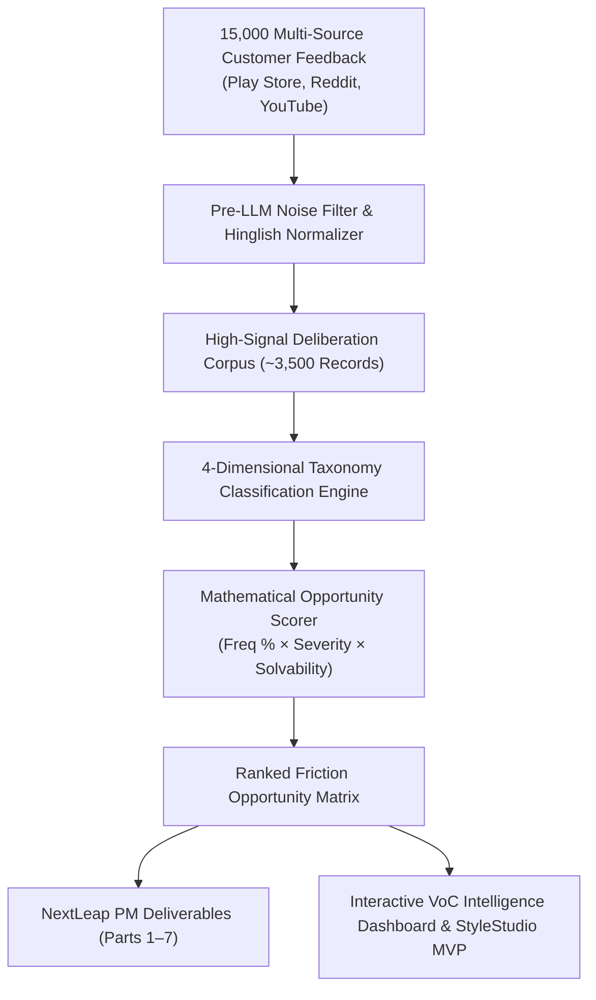

# 🛍️ Myntra AI-Powered VoC Discovery & Growth Intelligence Engine

> An enterprise-grade Voice-of-Customer (VoC) analytics and product intelligence platform designed to diagnose, quantify, and solve **Wishlist Stagnation** in fashion e-commerce.

---

## 🎯 Target Metric & Core Constraint

- **North Star Metric**: **30-Day Wishlist-to-Purchase Conversion Rate** (% of users purchasing $\ge 1$ item from their wishlist within 30 days).
- **Strict Non-Negotiable Constraint**: **STRICTLY ZERO MONETARY INCENTIVES**. No discounts, coupons, price-drop alerts, markdown notifications, or cashback. All solutions must be purely psychological, informational, visual, or UX-driven.
- **Corpus Scale**: **15,000+ customer records** ingested across Google Play Store/App Store reviews (10k), Reddit fashion forums (`r/IndianFashionAddicts`, `r/TwoXIndia`) (3.5k), and YouTube try-on haul comments (1.5k).

---

## 🏗️ System Architecture



---

## 🧠 4-Dimensional Taxonomy Engine

Every customer review is classified across 4 orthogonal dimensions:

1. **Wishlist Intent**: `GENUINE_PURCHASE_INTENT`, `AESTHETIC_BOOKMARKING`, `SHORTLIST_COMPARISON`, `PRICE_SPECULATION`
2. **Root Friction**: `FIT_AND_SILHOUETTE_AMBIGUITY`, `STYLING_AND_PAIRABILITY_ANXIETY`, `FABRIC_AND_TACTILE_DOUBT`, `SOCIAL_VALIDATION_LAG`, `OCCASION_DISCONNECT`, `COMPARISON_PARALYSIS`
3. **Offline Workaround**: `WHATSAPP_SHARING`, `YOUTUBE_TRYON_SEARCH`, `PINTEREST_CANVA_MOODBOARDING`, `BRACKETING`
4. **User Cohort**: `STUDENT_GEN_Z`, `WORKING_PROFESSIONAL`, `TIER_2_ASPIRATIONAL`

---

## 📊 NextLeap PM Deliverables Suite (Parts 1–7)

Located in [`Part_1_to_7_NextLeap_Deliverables.md`](Part_1_to_7_NextLeap_Deliverables.md):
- **Part 1**: 10-Question Discovery Audit
- **Part 2**: 30-Day Wishlist-to-Purchase Funnel Metric Decomposition Tree
- **Part 3**: 5 Qualitative User Personas & Interview Scripts
- **Part 4**: Root-Cause PM Problem Statement (Business Metric $\rightarrow$ Product Outcome $\rightarrow$ Root Cause)
- **Part 5**: MVP Product Spec for **Myntra "StyleStudio"** (Outfit Visualizer & Body-Matched UGC Carousel)
- **Part 6**: L1/L2 Metrics, Leading Behavioral Indicators, and Guardrail Metrics
- **Part 7**: Failure Modes, Edge Cases, and Risk Mitigation Matrix

---

## 🚀 Quick Start & Installation

### 1. Clone the Repository
```bash
git clone https://github.com/kartikey-dotcom/Myntra-AI-discovery-review-system.git
cd Myntra-AI-discovery-review-system
```

### 2. Set Up Virtual Environment & Dependencies
```bash
python -m venv venv
# On Windows:
.\venv\Scripts\activate
# On macOS/Linux:
source venv/bin/activate

pip install -r requirements.txt
```

### 3. Configure Environment Variables (Optional for Live LLM Mode)
```bash
cp .env.example .env
# Add your GEMINI_API_KEY or OPENAI_API_KEY in .env
```

### 4. Run the Full Analytics Pipeline
```bash
python run_engine.py
```

### 5. Launch Interactive VoC Dashboard & StyleStudio MVP
```bash
uvicorn src.api.main:app --reload --port 8000
```
Open **`http://localhost:8000`** in your browser.

---

## 📁 Repository Structure

```
├── Docs/                                    # Documentation and design specs
│   ├── Part_1_to_7_NextLeap_Deliverables.md # Consolidated PM Capstone report
│   ├── architecture.md                     # Deep technical architecture
│   ├── problemStatement.md                 # Core problem & constraints
│   └── edgecase.md                         # Edge cases & failure mitigations
├── data/                                   # Data pipeline outputs & artifacts
│   ├── raw_15k_corpus.json                 # Ingested multi-source records
│   ├── normalized_corpus_15k.json          # Pre-filtered & Hinglish normalized data
│   ├── classified_corpus_15k.json          # 4D taxonomy labeled dataset
│   └── ranked_opportunity_matrix.json      # Mathematical opportunity scores
├── frontend/                               # Interactive VoC Web Dashboard & Simulator
│   ├── index.html                          # Single-page UI
│   ├── styles.css                          # Vanilla CSS design system
│   └── app.js                              # UI interactions & live LLM query bridge
├── src/                                    # Python source code
│   ├── analytics/                          # Opportunity scoring math
│   ├── api/                                # FastAPI backend server
│   ├── classification/                     # 4D taxonomy classifier engine
│   ├── generators/                         # Deliverables builder & markdown synthesizer
│   ├── ingestion/                          # Play Store, Reddit, YouTube scrapers & fail-safe
│   ├── pipeline/                           # Noise filtration & Hinglish normalizer
│   └── utils/                              # Grounded LLM client & helpers
├── tests/                                  # Comprehensive automated test suite
│   ├── test_pipeline.py                    # E2E pipeline unit & integration tests
│   └── test_audit_constraints.py           # Strict zero-monetary compliance tests
├── run_engine.py                           # Master end-to-end execution script
├── requirements.txt                        # Python dependencies
└── README.md                               # Project documentation
```

---

## 🧪 Testing & Verification

Run the test suite to verify pipeline integrity and zero-monetary constraint adherence:
```bash
pytest tests/ -v
```

---

## 🛡️ License
Built for NextLeap Product Management Capstone. MIT License.
