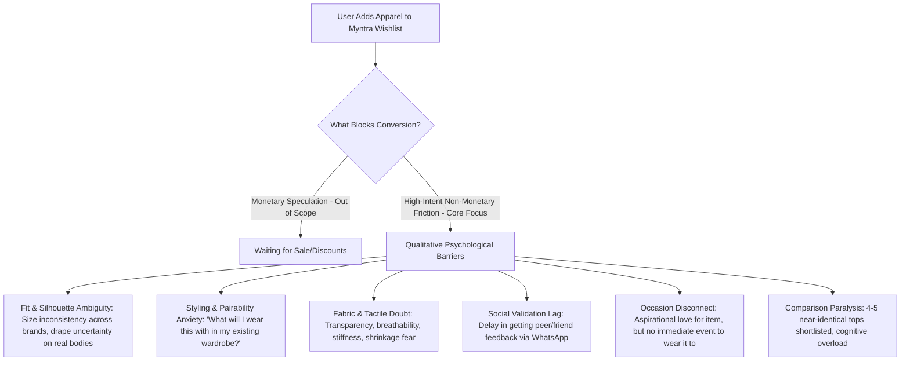
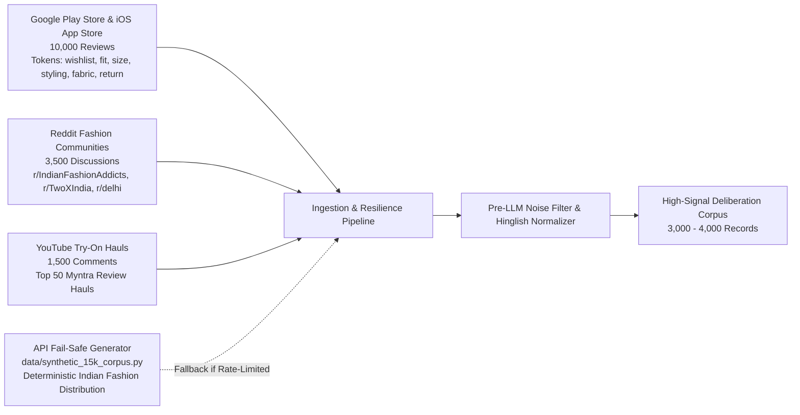

# Master Problem Statement: Myntra VoC Discovery & Growth Intelligence Engine

---

## 1. Executive Summary & Context

In Indian fashion e-commerce, the **Wishlist** is one of the most high-intent yet underperforming surfaces. On **Myntra**, millions of users actively browse, curate, and save items to their Wishlist. However, a massive percentage of these items languish indefinitely without converting into purchases.

### Primary Business Metric & Objective
- **Target Metric**: **30-Day Wishlist-to-Purchase Conversion Rate**  
  $$\text{Wishlist-to-Purchase Conversion Rate (30D)} = \frac{\text{Unique Users purchasing } \ge 1 \text{ item from Wishlist within 30 Days of adding}}{\text{Total Unique Users who added } \ge 1 \text{ item to Wishlist}} \times 100$$
- **Core Objective**: Ingest, clean, normalize, and classify a **15,000+ record Voice of Customer (VoC) corpus** across multi-channel qualitative sources to discover, quantify, and systematically eliminate the **non-monetary friction points** that cause wishlist abandonment.

### Non-Negotiable Constraint
> [!IMPORTANT]
> **STRICTLY ZERO MONETARY INCENTIVES**: No discounts, markdown alerts, price-drop push notifications, coupons, cashbacks, or loyalty point schemes.  
> All solutions must be **strictly psychological, informational, visual, UX, and AI-driven** to address customer hesitation at the root cause.

---

## 2. Core Problem Decomposition & Friction Landscape

Wishlist abandonment on Myntra is widely misdiagnosed as purely price-driven (*"waiting for the End of Reason Sale"*). In reality, extensive VoC analysis reveals that **non-monetary friction** accounts for the majority of high-intent purchase termination:

### 2.1 The 4 Structured Classification Dimensions

Every piece of feedback in the 15,000+ corpus is classified across 4 key dimensions:

| Dimension | Description | Analytical Classes |
|---|---|---|
| **Dim 1: Wishlist Behavioral Intent** | Underlying motivation when saving the item | `GENUINE_PURCHASE_INTENT`, `AESTHETIC_BOOKMARKING`, `SHORTLIST_COMPARISON`, `PRICE_SPECULATION` |
| **Dim 2: Non-Monetary Root Friction** | Specific qualitative hesitation preventing checkout | `FIT_AND_SILHOUETTE_AMBIGUITY`, `STYLING_AND_PAIRABILITY_ANXIETY`, `FABRIC_AND_TACTILE_DOUBT`, `SOCIAL_VALIDATION_LAG`, `OCCASION_DISCONNECT`, `COMPARISON_PARALYSIS` |
| **Dim 3: Offline User Workarounds** | Unmet needs solved through manual external behaviors | `WHATSAPP_SHARING` (screenshotting), `YOUTUBE_TRYON_SEARCH` (haul videos), `PINTEREST_CANVA_MOODBOARDING` (outfit collages), `BRACKETING` (ordering 2 sizes to return 1) |
| **Dim 4: Target User Cohorts** | Demographic & lifestyle segment | `STUDENT_GEN_Z`, `WORKING_PROFESSIONAL`, `TIER_2_ASPIRATIONAL` |

---

## 3. The 15,000+ Multi-Source VoC Corpus

To uncover authentic user sentiment, the discovery engine ingests unstructured customer feedback across multiple external and internal touchpoints:

---

## 4. Opportunity Scoring Framework

To scientifically prioritize which friction point Myntra product teams should solve first, every friction cluster is evaluated using the standardized **Opportunity Scoring Formula**:

$$\mathbf{\text{Opportunity Score}} = \mathbf{\text{Frequency Share (\%)}}\times \mathbf{\text{Severity (1–5)}}\times \mathbf{\text{Non-Monetary Solvability (1–5)}}$$

### Component Definitions:
1. **Frequency Share (%)**: Percentage of genuine non-monetary deliberation records that express this barrier.
2. **Severity (1–5)**: The degree to which this friction completely stalls or terminates the purchase decision (1 = Minor hesitation, 5 = Complete drop-off / cart abandonment).
3. **Non-Monetary Solvability (1–5)**: Feasibility of completely resolving this hesitation purely through UI/UX improvements, generative AI, computer vision styling, or social mechanics (1 = Hardware/logistics bound, 5 = Highly addressable via in-app experience).

---

## 5. Scope of Capstone Deliverables (Parts 1 to 7)

The discovery engine delivers the complete **NextLeap Product Management Capstone Suite**:

- **Part 1: VoC Discovery Audit & Opportunity Matrix**
  - NextLeap 10-Question Discovery Audit addressing intent distribution, drop-off triggers, and cohort variations.
  - Ranked Opportunity Matrix with mathematical scores and verbatim customer quotes.
- **Part 2: Metric Decomposition & Operational Funnel**
  - Mathematical tree decomposing Wishlist-to-Purchase conversion into actionable funnel levers.
- **Part 3: Primary Qualitative Personas & Discussion Guides**
  - 5 exhaustive user profiles representing Gen-Z, Corporate, and Tier-2 cohorts with semi-structured interview scripts.
- **Part 4: PM Problem Statement Evolution**
  - Root Cause Analysis mapping Business Metric $\rightarrow$ Product Outcome $\rightarrow$ Behavioral Root Cause.
- **Part 5: MVP Specification (Myntra "StyleStudio" & Body-Matched UGC)**
  - Detailed feature specifications for the #1 opportunity solution: Interactive Outfit Pairing Visualizer & Body-Matched Customer UGC Carousel.
- **Part 6: Comprehensive Metrics Framework**
  - North Star, L1/L2 outcomes, Leading behavioral metrics, and Guardrails with exact formulas.
  - **Part 7: Risks, Edge Cases & Mitigation Matrix**
  - Assessment of technical, UX, and behavioral risks with robust countermeasures.

---
